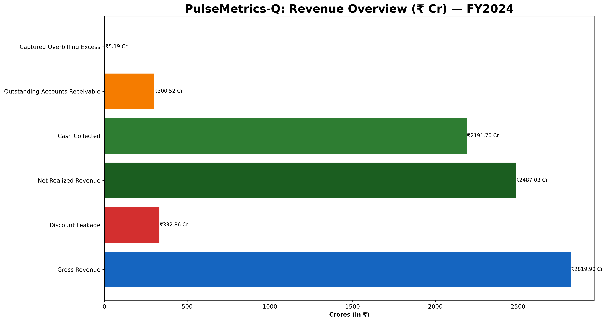
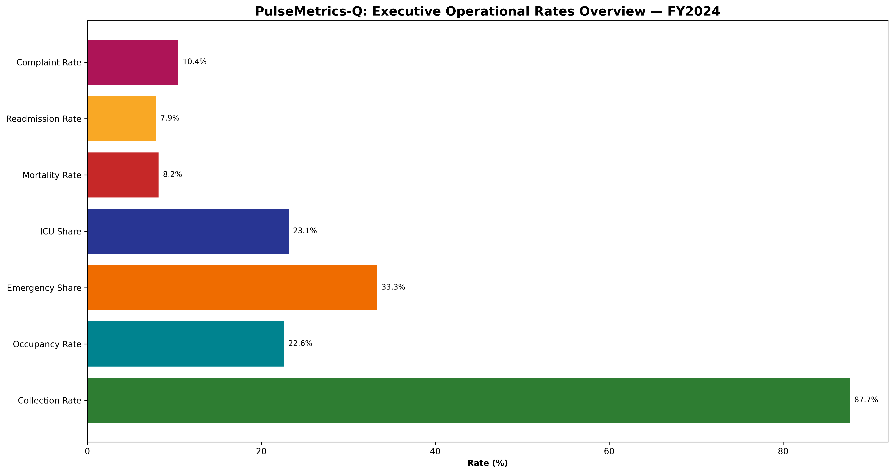
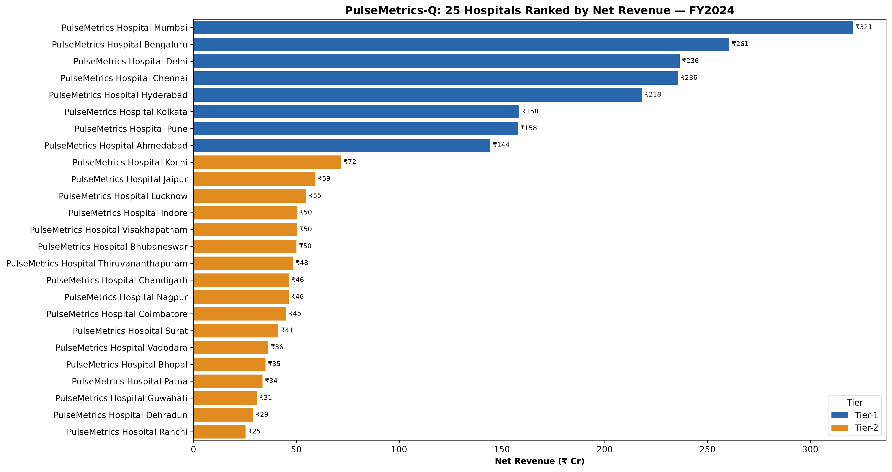

# 🏥 PulseMetrics-Q — Hospital Chain Analytics (Pan-India EDA)

> **End-to-end Python EDA project simulating annual performance intelligence
> for a 25-branch pan-India hospital chain — built in public on LinkedIn**

---

## 📌 Project Overview

**PulseMetrics-Q** is a portfolio-grade healthcare analytics project built entirely in Python.
It simulates the annual performance reporting of a Manipal-scale hospital chain — covering
synthetic data engineering, multi-layer data quality auditing, multi-domain exploratory data analysis,
and actionable insight delivery.

**Why synthetic data?**
Real patient data is protected under clinical privacy regulations. This dataset replicates the
*statistical properties, domain logic, and realistic messiness* of live hospital operations data —
making it fully valid for portfolio-grade analytics work.

📢 **Follow the build series on LinkedIn:** [#PulseMetricsQ](https://www.linkedin.com/search/results/content/?keywords=%23PulseMetricsQ)

---

## 🏗️ Dataset Architecture — 9 Interlinked Tables

| Table | Rows | Role |
|---|---|---|
| `dim_hospitals` | 25 | 25 branches across India (Tier-1 & Tier-2 cities) |
| `dim_patients` | ~60,300 | Unique patient master with demographics |
| `dim_doctors` | 800 | Doctor, specialization & department reference |
| `dim_icd_codes` | 57 | Diagnosis classification (ICD-10) |
| `fact_admissions` | ~120,600 | Core admission records — the central fact table |
| `fact_billing` | ~120,000 | Revenue, collection & payer records |
| `fact_lab_orders` | 200,000 | Lab test, TAT & result records |
| `fact_pharmacy_orders` | 180,000 | Drug dispensing & stockout records |
| `fact_patient_feedback` | 40,000 | CSAT, NPS & complaint survey data |

**Total: ~720,000+ rows across 9 interlinked tables**

All tables are joined into a single `admission_master` table (118,800 rows × 86 columns)
for unified analysis.

---

## 🔬 Data Generator — What Makes This Realistic (v3.1)

The dataset is generated with domain-aware non-uniform distributions, not random noise:

| Feature | How it's simulated |
|---|---|
| **Wide seasonal admissions** | Monthly volume ranges from 5,700 → 13,500 (Monsoon peaks, Summer lows) |
| **Seasonal ALOS multipliers** | Monsoon avg 4.1 days vs Winter avg 7.8 days |
| **Dynamic monthly payer mix** | June: 5.4% discount vs December: 17.8% discount |
| **Weekday bias** | Weekday:Weekend admission ratio ~1.1:0.75 (mirrors real elective scheduling) |
| **Centre of Excellence profiles** | Each hospital has a dominant department specialty |
| **Gender-biased departments** | Gynecology → Female patients; Urology → Male skew |
| **Payer-specific discounts** | Self-Pay 0–5%, Govt 15–25%, Cashless 8–15% |
| **Payer × Tier collection rates** | Cashless ~93%, Self-Pay ~81%, Govt ~77% |
| **Variable billing lag** | Day-care 0–1d, ICU 2–7d, Tier-2 hospitals +0–2d |
| **Test-specific result distributions** | CBC 5% Critical, Troponin 25% Critical |
| **Bimodal age distribution** | Paediatric peak + middle-age bulk (realistic for India) |
| **Severity-linked outcomes** | Mortality & readmission correlated with severity, not random |

---

## 🔍 Dirty Data Engineered In

Every anomaly below was intentionally injected for the data quality audit exercise:

| Table | Issue | Volume |
|---|---|---|
| `fact_admissions` | Discharge before admission date | ~1,206 rows |
| `fact_admissions` | Missing `bed_id` | ~3% of rows |
| `fact_admissions` | Duplicate admission IDs | ~594 rows |
| `fact_billing` | Collected amount > Net amount (overbilling) | ~2,400 rows (₹5.19 Cr excess) |
| `fact_lab_orders` | Report delivered before sample collected | ~3,000 rows |
| `fact_lab_orders` | Missing `tat_hours` | ~4,000 rows (imputed from timestamps) |
| `fact_pharmacy_orders` | Qty dispensed > Qty ordered | ~1,800 rows (clinical audit exhibit) |
| `fact_pharmacy_orders` | Invalid stockout records | 52 rows (archived) |
| `fact_patient_feedback` | NPS score outside −100/+100 range | ~1% of rows |
| `dim_patients` | Invalid age (−1) | ~0.8% of rows |
| `dim_patients` | Near-duplicate patient records | ~0.5% of rows |

---

## 📊 EDA Domains — 8 Sections

| # | Domain | Key KPIs |
|---|---|---|
| **S1** | Feature Engineering | Temporal, demographic, clinical, financial, experience features |
| **S2** | Executive Scorecard | Net revenue ₹2,487 Cr, 118,800 admissions, 87.7% collection rate, 8,530 beds, ALOS 5.92d |
| **S3** | Revenue & Financial Health | Monthly/quarterly trends, service-line mix, payer collection, Pareto, overbilling audit |
| **S4** | Clinical Operations & Efficiency | ALOS by dept/severity, LOS distribution, occupancy, TAT & SLA, pharmacy audit |
| **S5** | Patient Experience & Satisfaction | CSAT, NPS proxy, complaint mix, experience driver analysis (33.3% feedback coverage) |
| **S6** | Workforce & Doctor Performance | Productivity, revenue per doctor, outcome rates, experience effect, fee positioning |
| **S7** | Patient Demographics & Market | Age/gender, geographic origin, catchment flow, new vs repeat, referral channels |
| **S8** | Cross-Cuts & Hero Insights | Revenue-vs-CSAT quadrant, efficiency vs acuity, readmission hotspots, seasonality story |

---

## 📁 Project Structure

```
PulseMetrics-Q/
│
├── README.md                              ← You are here
├── PulseMetrics-Q_EDA_Roadmap.md         ← KPI playbook & visual guidelines
│
├── 1. Data Generator/
│   ├── data_generator.py                 ← Reproducible synthetic data generator (v3.1)
│   └── data/raw/                         ← Generated CSVs (source)
│
├── 2. Rawdata/                           ← Raw CSVs used by the notebook
│
├── 3. Data Dictionary/                   ← Column-level metadata for all 9 tables
│
├── clean_data/                           ← Post-audit cleaned CSVs (all 9 tables)
│
├── PulseMetricsHospital_EDA.ipynb        ← 📓 Main EDA notebook (GitHub publish version)
├── PulseMetricsHospital_EDA-Raw.ipynb   ← 📓 Raw working notebook (full scratch work)
│
└── outputs/
    ├── figures/                          ← Saved chart PNGs (dpi=300)
    │   ├── 00_executive_revenue_indicators.png   ✅ Revenue overview (₹ Cr) bar chart
    │   ├── 01_chain_key_rate_indicators.png      ✅ Operational rates (%) bar chart
    │   └── 02_branch_revenue_ranking.png         ✅ 25 branches ranked by net revenue
    │
    └── reports/                          ← Exported CSV summaries
        ├── 00_chain_executive_scorecard.csv      ✅ 22-metric chain executive summary
        └── 01_hospital_branch_summary_table.csv  ✅ All 25 branches with 14 KPIs
```

---

## 🔑 Key Findings So Far (Section 2 — Executive Scorecard)

| Metric | Chain Performance (FY2024) |
|---|---|
| Total Inpatient Admissions | **118,800** |
| Unique Patients Served | **52,006** |
| Chain Total Bed Capacity | **8,530 Beds across 25 Hospitals** |
| Total Gross Revenue | **₹ 2,819.90 Cr** |
| Total Discount Leakage | **₹ 332.86 Cr (11.80%)** |
| Total Net Realized Revenue | **₹ 2,487.03 Cr** |
| Total Cash Collected | **₹ 2,191.70 Cr** |
| Outstanding Accounts Receivable | **₹ 300.52 Cr** |
| Clean Collection Efficiency Rate | **87.67%** |
| Captured Overbilling Excess | **₹ 5.19 Cr** |
| Avg Revenue Per Admission (ARPA) | **₹ 2,09,346** |
| Avg Revenue Per Occupied Bed-Day (ARPOB) | **₹ 35,346 / day** |
| Average Length of Stay (ALOS) | **5.92 days** |
| Chain-Wide Bed Occupancy Rate | **22.60%** |
| Emergency Admission Share | **33.30%** |
| In-Hospital Mortality Rate | **8.19%** |
| 30-Day Unplanned Readmission Rate | **7.88%** |
| Overall Patient CSAT (1–6 Likert Scale) | **3.49 / 6.00** |
| Chain Net Promoter Score (NPS Proxy) | **+43.5** |

> **Top hospital by revenue:** PulseMetrics Hospital Mumbai — ₹320.79 Cr  
> **Smallest hospital:** PulseMetrics Hospital Ranchi — ₹25.33 Cr

### 🖼️ Executive Visual Highlights

| Executive Revenue Indicators | Operational Rates Overview |
|:---:|:---:|
|  |  |

#### 🏆 25 Hospital Branches Ranked by Net Revenue (FY2024)


📄 **Supporting Data Reports:**
- [`00_chain_executive_scorecard.csv`](outputs/reports/00_chain_executive_scorecard.csv) — 22 executive-level KPIs
- [`01_hospital_branch_summary_table.csv`](outputs/reports/01_hospital_branch_summary_table.csv) — Complete 25-hospital performance league table

---

## ⚙️ Setup & Run

```bash
# 1. Clone the repo
git clone https://github.com/SpartanSubha/PulseMetrics-Q-Hospital-Analytics.git
cd PulseMetrics-Q-Hospital-Analytics

# 2. Install dependencies
pip install pandas numpy matplotlib seaborn jupyter

# 3. Generate all 9 datasets (~2 minutes)
python "1. Data Generator/data_generator.py"

# 4. Open the EDA notebook
jupyter notebook PulseMetricsHospital_EDA.ipynb
```

---

## 🛠️ Tech Stack

`Python 3.12` · `Pandas` · `NumPy` · `Matplotlib` · `Seaborn` · `Jupyter Notebook`

> **Visual philosophy:** All charts use only standard `seaborn` and `matplotlib` functions —
> beginner-friendly, reproducible, and interview-ready.

---

## 📈 Project Status

| Section | Domain | Status |
|---|---|---|
| S1 | Feature Engineering | ✅ Complete |
| S2 | Executive Scorecard | ✅ Complete — Post #1 Published |
| S3 | Revenue & Financial Health | 🔄 In Progress — Post #2 Coming Soon |
| S4 | Clinical Operations & Efficiency | 📋 Planned |
| S5 | Patient Experience & Satisfaction | 📋 Planned |
| S6 | Workforce & Doctor Performance | 📋 Planned |
| S7 | Patient Demographics & Market | 📋 Planned |
| S8 | Cross-Cuts & Hero Insights | 📋 Planned |

---

## 👤 Author

**Subhabrata Sahoo**  
MBA (Marketing & Operations) · Data & Business Analytics  
📧 sahoosubhabrata0@gmail.com 
📁 [Resume](https://github.com/SpartanSubha/resume)
🔗 [LinkedIn](https://linkedin.com/in/subhabrata99) · [GitHub](https://github.com/SpartanSubha)

---

*Building in public — follow the journey on LinkedIn: [#PulseMetricsQ](https://www.linkedin.com/search/results/content/?keywords=%23PulseMetricsQ)*
